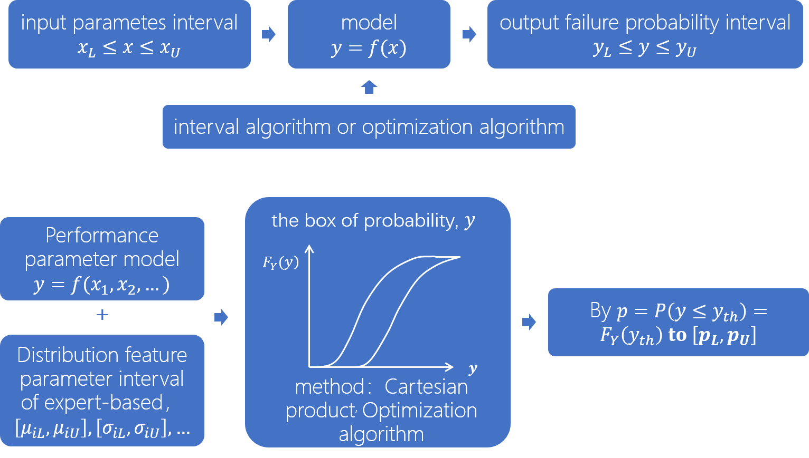

# General map of reliability (The summary of Kang's seminar in CAS)

## 1. The origin of reliability

### 1.1 The reliability in World War 2

&emsp;&emsp;In order to infer the failure probability of rocket launch during the period of World War 2, Robert Lusser[1] provided the probability measure, which is the early development of reliability. Based on the classical probability theory[2], the relevant researches about reliability also keep to the following principles:

- Axiom 1. The probability of an event is a non-negative real number:

$$
P(E)\in \Bbb{R},P(E) \geq 0 \qquad \forall E\in F \tag{1}
$$

&emsp;&emsp;&emsp;where, $F$ is the event space. It follows that $P(E)$ is always finite.

- Axiom 2. The probability that at least one of the elementary events in the entire sample space occur is 1, which obeys the assumption of unit measure:

$$
P(\Omega)=1 \tag{2}
$$

- Axiom 3. Relying on the assumption of $\sigma$-additivity[4], any countable sequence of disjoint sets (synonymous with mutually exclusive events) $E_1, E_2, ...$ statisfies:

$$
P(\bigcup_{i=1}^{\infty}E_i)=\sum_{i=1}^{\infty}P(E_i) \tag{3}
$$

&emsp;&emsp;&emsp;that is to, for the independent events, the probability of either event occurring is the sum of the probability of each event occurring.

&emsp;&emsp;From the Kolmogorov axioms, one can deduce the chain rule[5] (also called the general product rule), which permits the calculation of any member of the joint distribution of a 
set of random variables, and is also useful for Bayesian Networks. 

&emsp;&emsp;Especially for the mutally exclusive events, we will have:

$$
P(\prod_{i=1}^{\infty}E_i)=\prod_{i=1}^{\infty}P(E_i) \tag{4}
$$

&emsp;&emsp;According to the principles mentioned above of probability, the researchers built the theory frame of reliabililty in the early stage, includes:

- Utilize the probability to represent the reliability of each unit or system;
- Unit reliability = 1 - failure probability;
- The failure probability can be acquired by statistical methods;
- The system reliability calculated by the product of each unit (cascade model);

 
Fig 1. The origiaon of reliability

### 1.2 DoD AGREE - The report about reliability

&emsp;&emsp;Based on the excellent works of R.Lusser, DoD published the AGREE report in 1957. From this report, the definition of reliability was elucidated formally and sophisticatedly: 

- Reliability is definied as the probability that a system will perform its intended function for a specified interval within a given time and under specified conditions;
- The reliability can be calculated by the formula: $R(t)=P(T>t)$, noted $t$ is the regular time, and $T$ is the longevity of products;
- Construct the index system, such as, MTBS, failure rate, etc;
- Determine the method of reliability allocation and PFA;
- Design the Reliability Acceptance Test, a statistics test method;

&emsp;&emsp;So as to practical:

- Provide the measures about the reliability design, like damping, heat-dissipated;
- Provide the redundant design for critical parts;
- Indicate that necessary measures should be taken to ensure the reliability requirements of purchasing parts;
- Indicate that enhance the failure feedback to improve the product design to realize the sustained growth of reliability; 

&emsp;&emsp;Above all, the early development of reliability relies on probability, statistics, the law of large numbers as well. And as for the engineering application, it can be concluded that the pattern "index selection-index predication-experimental confirmation-failure analysis-design improvement" has been determined. 

## 2. The development of reliability

&emsp;&emsp;With the technology developed rapidly, the reliability has been attracted more and more attention both in industry, military as well as aerospace field, and the reliability theory also made a great leap, which developed 4 branches: statistics-based, physical-based, logical model and reliability design.

### 2.1 Statistics-based method

&emsp;&emsp;The validity of the statistics-based reliability prediction method is guaranteed by LLB and probability axioms, which applies the frequency to evaluate the probability. Thus, we are allowed to count the failure events and predict the failure probability.

 
Fig 2. Statistical Analysis of Failure Data - Failures Percentage of Product Components

&emsp;&emsp;In addition, the researchers also defined various indexes to represent the reliability:

- Failure rate ($\lambda$)[7]: the frequency with which an engineered system or component fails, expressed in failures per unit of time;
- Mean time between faiures (MTBR, $1/\lambda$): the predicted elapsed time between inherent failures of a mechanical or electronic system, during normal system operation. While about the non-repairable system, we apply mean time of failure (MTTF) to measurement;
- Mean time to repair (MTTR): represents the average time required to repair a failed component or device[8]. As far as i'm concerned, it is the total corrective maintenance time for failures divided by the total number of corrective maintenance actions for failures during a given period[9];
- Reliable Life: the life for which the unit/item will be functioning successfully with the reliability of $R$;
- The time between overhauls (TBO or TBOH): the manufacturer's recommended number of running hours or calendar time before an aircraft engine or other component requires overhaul[10];
- Availability[11]: The degree to which a system or equipment is in a specified operable and committable state at the start of a mission, when the mission is called for at an unknown, i.e, a random, time. Simply put, availability is the proportion of time a system is in a functioning condition. This is often described as a mission capable rate. Mathematically, this is expressed as 100% minus unavailability. And it also can be explained as the ratio of the total time a functional unit is capable of being used during a given interval to the length of the interval;

&emsp;&emsp;In order to shed the lights on the product failure, the researchers also design numerous statistical test methods for the design and manufacturing process, such as Environmental Stress Screening (ESS)[12] Reliability Acceptance Test, Reliability Growth Test[13], Accelerated Life Test (ALT) [14], Accelerated Degradation Test (ADT), etc. And according to a huge amount of repeat experiment results, researchers are able to design empirical formulas to represent the failure rate distinctly: 

 
Fig 3. Failure model of electronic components

&emsp;&emsp;While, about the statistical method to predict the failure probability has four essential defects: 

1) In real engineering applications, the failure happens is rare, which is small sample events, thus it doesn't meet the requirements of LLB, and the prediction accuracy will be affected dramatically; 
   
2) Contribute to the statistics requirement, only when the failure happens can we collect the data. Thus, beforehand reliability prediction is not allowed;
   
3) The statistical models only give us a number about the failure probability, which can not provide any clue about the improvement direction. In consequence, it is useless for engineering practice; 

4) Boil down to the cascade model and probability production principle, the product failure rate will be extremely small. However, it is not consistent with the fact;

&emsp;&emsp;By the way, about the small sample estimation is always a difficulty in statistics and machine learning, which is not satisfied the LLB (While, about the massive data statistics, the sampling strategy will be an art, how can we take sample to reflect the overall distribution and realize unbiased estimate). The valid solve strategies are to introduce more external information and merge abundant Priori knowledge. For instance, the Bayes method relies on the posterior probability to amend the prior probability continuously, so the estimation will be better and better. As for other methods are the same idea. About the dilemma that probability tends to zero caused by a continued product, which is similar to the Vanishing Gradient Problem in Back Propagation algorithm. Hence, whether we can referent the ResNet idea, using skip product method to alleviate this problem. Or can we apply the attention mechanism provided in the machine translation, select the core parts to calculate the reliability? Besides, although it seems reasonable for the cascade model to calculate the continued product, in the real situation, it is impossible. Tracing to its root, the assumption of independence for each unit is quite strictly. It means the failure probability of a model is not equal to the failure probability product of each part. Therefore, we can not usage this formula simply, especially for the parts level. Or we have to design a more rational formula for the failure probability calculation, at least aiming the weak link and taking the maximum value for all the units is a feasible strategy.

### 2.2 Physical method

&emsp;&emsp;To overcome the above challenges, researchers attempt to figure out the mechanism of failures, to research the physical model of parts, material, process, etc. 

&emsp;&emsp;Therefore, the failure time model has been proposed, which also named the causality model: 

 
Fig 4. Failure time model

&emsp;&emsp;Furthermore, the working state of products can not be the same in the whole life, consider the performance degradation of the product lifecycle, experts further provided the performance degradation model: 

 
Fig 5. Performance degradation model

&emsp;&emsp;The physical model could analysis the essential reason for failures, and stimulate to acquire the reliability index through the parameter randomization. Thus, the drawbacks of the statistical model, such as a small sample, hard to improve, can be relieved effectively. 

&emsp;&emsp;Nevertheless：

1) How can we construct the physical model, it's difficult to figure out the intrinsic mechanism and determine the key factors which affect the item most. 
2) In addition, it is a common method to specify parameters obey the Gaussian distribution, while how can we ensure the correctness of this precondition. Whether can we utilize the mixture gaussian to build the model?

### 2.3 Logic model

&emsp;&emsp;Through decompose the system or module into the independent item/unit to rebuild it, and determine the logic relation between each part, then analysis the failure probability. The typical logic model includes a failure tree model and probability graph model, showing as follow:

 
Fig 6. Reliability frameworks

&emsp;&emsp;FTA (Fault tree analysis)[15] is a valid method for reliability evaluation. FTA is a top-down, deductive failure analysis in which an undesired state of a system is analyzed using Boolean logic to combine a series of lower-level events. By understanding how systems can fail, to identify the best ways to reduce risk or to determine (or get a feeling for) event rates of a safety accident or a particular system level (functional) failure.  

 
Fig 7. Fault tree analysis

&emsp;&emsp;Logic model considers units work cause system work and units failure cause system failure, so that we can calculate the failure probability relying on the logic relation. While, since it also assumes the item/unit independent, the logic model faces probability ebbs quickly too. 

### 2.4 Reliability design

&emsp;&emsp;In spite of we can not bring the failure mechanism to the light, we are allowed to enhance the reliability in the design stage, such as derating design, protective design (thermal design, electromagnetic compatibility design, damping, anti-radiation design) for electronic products, safety factor design, and stress intensity design for mechanical products. This strategy can ensure the products' reliability effectively, especially for engineering applications.   

 
Fig 8. reliability design

&emsp;&emsp;All in all, whether the products can work properly and achieve the specific function or not, it is determined by the task requirements as well as user definition, which is reflected in the specific performance indexes. Hence, comparing to the performance parameter margins, we can adjust the system status. And the environment test and reliability enhanced test is just to confirm the performance margins. That is the positive thinking to solve the problem, rather than count the failure times and give the failure probability. 

&emsp;&emsp;But:

1) It is also obscure and arbitrary for experts to determine the value of margin; 

2) The performance margin can not be reflected the reliability measurement easily, which only reflect whether the failure will arise, and how likely it will arise; 

3) As for stress-intensity design, the distribution of stress and intensity are also be denoted as Gaussian distribution, which has not solide theoretical supports, and may have some problems in practice.  

## 3. Some solutions about the above challenges

&emsp;&emsp;Generally speaking, owing much to the inherent uncertain and cognition uncertain[16] that lead the aforementioned challenges. In order to overcome these problems and to make the prediction more accuracy, two major classes of methods have been proposed:    

- Inaccuracy probability reliability measurements: Bayes theory, Evidence theory, Interval analysis theory;
- Fuzzy reliability;

### 3.1 Bayes reliability

&emsp;&emsp; Based on Bayes theory, the posterior distribution can be represented like this:

$$
p(\theta | y)=\frac{f(y|\theta)p(\theta)}{m(y)} \tag{5}
$$

&emsp;&emsp;where, $p(\theta|y)$ denotes as posterior probability distribution, $f(y|\theta)$ denotes as likelihood function, $p(\theta)$ denotes as prior distribution, and $m(y)$ denotes as sample density function. Thus, we can adjust the prior distribution and rely on a small amount of failure data to estimate the reliability [17].

 
Fig 9. Bayes Theory

### 3.2 Evidence theory 

&emsp;&emsp;Proposed by A.Dempster and G.Shafer, evidence theory calculates the Belief and Plausibility to determine the probability interval[18]. To be specific, according to the weighted sum of failure assignment function for the variable interval to determine the failure probability interval[19]. 

 
Fig 10. Evidence Theory

&emsp;&emsp;Through introduce more expert knowledge or additional information to improve the prediction accuracy, while how to merge and utilize this supplementary information effectively, it is a question. What's more, transfer the point estimation to interval estimation, it seems more reliable for reliability evaluation, while how to balance the interval size, precision, and confidence is also a challenge.   

### 3.3 Interval analysis

&emsp;&emsp;The thought of interval analysis is quite plain, that is considering apply interval to represent the uncertainty[20]. Briefly speaking, this method realizes the transfer from input parameters interval to output failure probability interval based on interval algorithm or optimization algorithm.

 
Fig 11. Interval analysis Theory

&emsp;&emsp;While, the evidence method is still calculate the probability based on the cascade model. Thus, the problem of probability vanishes, and expansion is existing yet[22].

### 3.4 Fuzzy reliability

&emsp;&emsp;In the realistic world, almost everything is not blake or white, there is a middle area of gray. That's to say anything has a sort of uncertainty. We can not rely on the probability of measurement of this status. For instance, about the age, the stature, what's the age can be considered as younger or elder exactly, it is challenging to offer a standard answer. And the fuzzy theory is able to represent this uncertainty based on membership functions[23].       

&emsp;&emsp;About the reliability, fuzzy reliability points out that the system only has two states, work, and failure, in the meantime, consider the failure time $T$ is a fuzzy variable and define the possibility of $t>T$ to represent the reliability:

$$
R(t)=\Pi (T\geq t)\tag{6}
$$

&emsp;&emsp;While, there is a nature paradox between axiom 1 and axiom 2 of possibility theory.

$$
\begin{aligned}
    \because & \, \begin{cases}
                            axiom2:\Pi(\Gamma)=\Pi(\Lambda_1,\Lambda_2)=1\\
                            axiom3: \Pi(\Gamma)=max(\Pi(\Lambda_1), \Pi(\Lambda_2))=1\tag{7}
                         \end{cases}\\
    \therefore & \, \exists \; \Lambda_i=1, (i=1,2)\\
    \because & \, \Lambda_1,\Lambda_2 \; \text{are exclusive events}\\
    \therefore & \, 
    \begin{cases}
        \Lambda_1<1 \implies \Lambda_2=1\\
        \Lambda_2<1 \implies \Lambda_1=1
    \end{cases}
\end{aligned}
$$

&emsp;&emsp;Hence, possibility theory does not meet the normative, and it will not be suitable for reliability calculation[24].

### 3.5 Brief summary

&emsp;&emsp; Totally speaking, the early development of reliability is closed to the probability theory. It is applying the failure probability to measure the system reliability. While the fundamental of probability is a statistic, and in a realistic world, the failure happened are small sample events. Thus, it's difficult for us to acquire an accurate prediction, and only when the failures arise can we perform statistical analysis. In addition, the probability calculation of the cascade model faces the probability of vanishing problems. What's more, the failure probability is merely a number, which can not provide any suggestions about the improvement of the system. Attribute to the above defects. Researchers struggle to construct the physical model to analysis the cause of failures and based on the experiments as well as stimulation to predict the reliability and improve the system at the same time. While limited to cognitive uncertainty and inherent uncertainty, it is hard to determine the core factors and build comprehensive models. As for the logic model, it is a sophisticated method to analysis failure pattern and failure reasons, but about the reliability prediction, it is also powerless. In engineering practice, the technicists apply reliability design ( derating design, protective design, safety factor design, and stress intensity design) to ensure the reliability of the products, it is safe to say that it is a compelling work for tasks, but the problem still exists.

&emsp;&emsp;How to increase the reliability accuracy, there are three main strategies, include Bayes theory, interval estimation, and fuzzy theory. Must say the Bayes method is a powerful theoretical framework through introduce the posteriori information and external data to amend the prior knowledge and improve the accuracy. Fuzzy theory is also a genius thought, but it still has a little nibs. Well, belief reliability seems to provide a reasonable solution very recently.

## 4. Belief reliability

&emsp;&emsp;Basically speaking, reliability science follows the following three rules:

 
Fig 12. The principles of reliability science 

&emsp;&emsp;About the measurement of reliability, which also obeys the following principles: 

 
Fig 13. The principles of reliability measurement 

- The normalization principle avoids the dilemma(The sum of reliability and unreliability is not 1) of fuzzy reliability;
- The slow decay principle requires the reliability of items/systems can not too small, which corresponds to the drawback of the cascade model;
-  The controllable principle emphasizes that we can change the key factors to adjust the reliability, which paves the way for system improvement;
- The integration principle illustrates that the reliability should be measured by the uncertain degree, which determines by the performance margin;

&emsp;&emsp;Hence, there are some works that apply uncertainty to measure the reliability.

### 4.1 Uncertainty theory

&emsp;&emsp;Some information and knowledge are usually represented by human language like “about 100km”, “approximately 39 ◦C”, “roughly 80kg”, “low speed”, “middle age”, and “big size”. How do we understand them? Perhaps some people think that they are subjective probability or they are fuzzy concepts. However, a lot of surveys showed that those imprecise quantities behave neither like randomness nor like fuzziness. This fact provides a motivation to invent another mathematical tool, namely uncertainty theory. Uncertainty theory was founded by Liu[24] in 2007. Nowadays, uncertainty theory has become a branch of mathematics based on normality, monotonicity, self-duality, countable subadditivity, and product measure axioms. The first fundamental concept in uncertainty theory is the uncertain measure that is used to measure the belief degree of an uncertain event. The second one is the uncertain variable that is used to represent imprecise quantities. The third one is uncertainty distribution that is used to describe uncertain variables in an incomplete but easy-to-use way. Uncertainty theory is thus deduced from those three foundation stones, and provides a mathematical model to deal with uncertain phenomena.

&emsp;&emsp;Let $\Gamma$ be a nonempty set. A collection $\frak{L}$ of subsets of $\Gamma$ is called a $\sigma$-algebra if $(a)$ $\Gamma\in \frak{L}$; (b) if $\Lambda \in \frak{L}$, then $\Lambda^c \in \frak{L}$; and (c) if $\Lambda_1, \Lambda_2,...\in \frak{L}$. Each element $\Lambda$ in the $\sigma$-algebra $\frak{L}$ is called an event. Uncertain measure is a function from $\frak{L}$ to $[0,1]$. In order to present an axiomatic definition of uncertain measure, it is necessary to assign to each event $\Lambda$ a number $\frak{M}{\Lambda}$ which indicates the belief degree that $\Lambda$ will occur. In order to ensure that the number $\it{M}\{\Lambda\}$ has certain mathematical properties, Liu proposed the following five axioms:

- Axiom1. (Normality Axiom) $\it{M}\{\Gamma\}=1$ for the universal set $\Lambda$;
- Axiom2. (Monotonicity Axiom) $\it{M}\{\Lambda_1\}\leq \it{M}\{\Lambda_2\}$ whenever $\Lambda_1\subset \Lambda_2$;
- Axiom3. (Self-Duality Axiom) $\it{M}\{\Lambda\}+\it{M}\{\Lambda^c\}=1$ for any event $\Lambda$;
- Axiom4. (Countable Subadditivity Axiom) For every countable sequence of events $\{\Lambda_i\}$, we have:
$$
\it{M}\{\bigcup_{i=1}^{\infty}\Lambda_i\}\leq \sum_{i=1}^{\infty}\it{M}\{\Lambda_i\}\tag{8}
$$
- Axiom5. (Product Measure Axiom) The product uncertain measure $\it M$ is an uncertain measure on the product $\sigma$-algebra $\frak{L_1}\times \frak{L_2}\times ... \times \frak{L_n}$ satisfying: 
$$
\it{M}\{\prod_{k=1}^n\Lambda_k\}=min_{1\leq k\leq n}\it{M_k}\{\Lambda_k\}\tag{9}
$$

### 4.2 Chance theory

&emsp;&emsp;As a mixture of uncertainty theory and probability theory, chance theory[25] is to deal with problems affected by both aleatory uncertainty (randomness) and epistemic uncertainty. The basic concept in chance theory is the chance measure of an event in a chance space.

&emsp;&emsp;Let $(\Gamma,\frak{L}, \it{M})$ be an uncertainty space, and $(\Omega,\frak{A}, \it{Pr})$ be a probability space. Then $(\Gamma,\frak{L}, \it{M})\times (\Omega,\frak{A}, \it{Pr})$ is called a chance space. Then the chance measure of $\Theta$ is define as

$$
Ch\{\Theta\}=\int_0^1Pr\{w\in \Omega|\it{M}\{\gamma\in\Gamma|(\gamma,w)\in\Theta\}\geq x\}dx\tag{10}
$$

&emsp;&emsp;As a special uncertain random variable, the chance distribution of a random variable $\eta$ is just its probability distribution, that is:

$$
\Phi(x)=Ch\{\eta\leq x\}=Pr\{\eta\leq x\}\tag{11}
$$

&emsp;&emsp;As a special uncertain random variable, the chance distribution of an uncertain variable $\tau$ is just its uncertainty distribution, that is:

$$
\Phi(x)=Ch\{\tau\leq x\}=\it{M}\{\tau \leq x\}\tag{12}
$$

### 4.3 Brief reliability

### 4.3.1 Belief reliability Metric

&emsp;&emsp;In an uncertain random system, the states of some components are modeled as random variables and those of other components are described as uncertain variables. Therefore, the state variable of the system will be an uncertain random variable. When the system state variable is within a feasible domain, which reflects our tolerance degree of failure, the system is regarded to be reliable under this state. 

&emsp;&emsp;Therefore, Let a system state variable $\xi$ be an uncertain random variable, and $\Xi$ be the feasible domain of the system state. Then the belief reliability is defined as the chance that the system state is within the feasible domain[26], i.e.,  

$$
R_B=Ch\{\xi \in Xi\}\tag{13}
$$

&emsp;&emsp;This means the system is mainly influenced by aleatory uncertainty, and the belief reliability degenerates to the probability theory-based reliability metric.

&emsp;&emsp;If the state variable $xi$ degenerate to a random variable, the belief reliability metric will be a probability. Let $R_B^{(P)}$ denotes the belief reliability under probability theory. Then

$$
R_B=R_B^{(P)}=Pr\{\xi\in\Xi\}\tag{14}
$$

&emsp;&emsp;If the state variable ξ degenerate to an uncertain variable, the belief reliability metric will be a belief degree. Let $R_B^{(U)}$ denotes the belief reliability under uncertainty theory. Then

$$
R_B=R_B^{(U)}=\it{M}\{\xi\in\Xi\}\tag{15}
$$

&emsp;&emsp;This means the system is mainly influenced by epistemic uncertainty, and the belief reliability degenerate to the uncertainty theory-based reliability metric.

### 4.3.2 System belief reliability formulas

&emsp;&emsp;In an uncertain random system, the components mainly affected by aleatory uncertainty are regarded as random components whose failure times are described as random variables, while those mainly influenced by epistemic uncertainty are called uncertain components with failure times represented by uncertain variables. Sometimes, an uncertain random system can be simplified to be composed of two types of subsystems — a random subsystem only including random components and an uncertain subsystem only containing uncertain components, and the two types of subsystems will be connected in either series or parallel. We do not strictly require the configurations inside the two subsystems, and they can be very complicated. The belief reliability of this kind of system can also be calculated based on the following theorems.

- Series connect. Assume an uncertain random system is simplified to be composed of a random subsystem with belief reliability $R_{B,R}^{(P)}(t)$ and an uncertain subsystem with belief reliability $R_{B,R}^{(U)}(t)$. If the two subsystems are connected in series, the system belief reliability $R_{B,S}(t)$ will be

$$
R_{B,S}(t)=R_{B,R}^{(P)}(t)\cdot R_{B,R}^{(U)}(t)\tag{16}
$$

- Parallel connect. Assume an uncertain random system is simplified to be composed of a random subsystem with belief reliability $R_{B,R}^{(P)}$ and an uncertain subsystem with belief reliability $R_{B,U}^{(U)}$. If the two subsystems are connected in parallel, the system belief reliability will be

$$
R_{B,S}(t)=1-(1-R_{B,R}^{(P)}(t)) \cdot (1-R_{B,U}^{(U)}(t))\tag{17}
$$

## 4.4 The framework of belief reliability

&emsp;&emsp;In conclusion, the framework of belief reliability can be shown as below: 

 
Fig 14. The framework of belief reliability

&emsp;&emsp;From this picture, we can clearly see that a system possesses uncertainty and stochastic, which can be measured by probability theory and uncertainty measure. As to the mature parts that own a great deal of historical data, we can consider building it as a random system, and based on probability to measure. While about the new parts, we can utilize the probability to measure. In addition, the criterion of failure should depend on the performance margin of products, which exists uncertainty of model and parameters, and with time goes by, the performance will degenerate constantly.      

## 4.5 Summary

&emsp;&emsp;The main works of belief reliability include:

1) The definition and concept of belief reliability is expanded based on chance theory considering both aleatory and epistemic uncertainties; 

2) The belief reliability metric and its physical meaning is first interpreted in detail from the view of failure time, performance margin and function level; 

3)  Some new belief reliability indexes are proposed based on the new definition of belief reliability;

4) Several new system belief reliability formulas are developed to analyze the belief reliability of uncertain random systems. 

&emsp;&emsp;Generally speaking, the innovation of this work is that utilizing the belief reliability to alternative reliability, while the belief reliability can be measured by chance. And the big difference between chance and probability is that chance theory regards the reliability as the probability of the system at the feasible state condition. Therefore, it defines a new formula to calculate the chance value. Besides, if the state variable degenerates to a random variable, the belief reliability metric will be a probability. And if the state variable is an uncertain random variable, it will obey the uncertain distribution. What's more, the uncertainty theory tells us that the uncertain measure of a product equal to the minimum value of the uncertain measures for all the parts, which will alleviate the problem of vanishing probability when calculating the product of probability. In addition, an uncertain random system can be simplified to be composed of two types of subsystems — a random subsystem only including random components and an uncertain subsystem only containing uncertain components, the two types of subsystems will be connected in either series or parallel. The random subsystem obeys the probability framework, while the uncertain subsystem obeys brief reliability.

&emsp;&emsp;It is an amazing framework about the reliability discipline, but this new theory lacks considerable practical certifications, does not show the majorities, advantages, and what's the breakthrough compared with the traditional methods, now.

## 5. Reference

[1] Lusser's Law, Wikipedia, https://en.wikipedia.org/wiki/Lusser%27s_law.

[2] Kolmogorov, Wikipedia, https://en.wikipedia.org/wiki/Andrey_Kolmogorov.

[3] Probability axioms, Wikipedia, https://en.wikipedia.org/wiki/Probability_axioms.

[4] Hájek, Alan (August 28, 2019). "Interpretations of Probability". Stanford Encyclopedia of Philosophy. Retrieved November 17, 2019.

[5] Chain rule (probability), Wikipedia, https://en.wikipedia.org/wiki/Chain_rule_(probability).

[6] Law of large numbers, Wikipedia, https://en.wikipedia.org/wiki/Law_of_large_numbers.

[7] Failure rate, Wikipedia, https://en.wikipedia.org/wiki/Failure_rate.

[8] BusinessDictionary.com, Mean Time To Repair definition.
 
[9] Institute for Telecommunications Sciences, Mean Time To Repair definition Archived 2008-09-25 at the Wayback Machine.

[10] Teledyne Continental Motors (17 November 1998). "Time Between Overhaul Periods" (PDF). Retrieved 3 January 2015.

[11] Availability, Wikipedia, https://en.wikipedia.org/wiki/Availability.

[12] Environmental stress screening (ESS), Wikipedia, https://en.wikipedia.org/wiki/Environmental_stress_screening.

[13] Reliability Growth Planning, Reliawiki, http://reliawiki.org/index.php/Reliability_Growth_Planning.

[14] Accelerated life testing, Wikipedia, https://en.wikipedia.org/wiki/Accelerated_life_testing.

[15] Fault tree analysis, Wikipedia, https://en.wikipedia.org/wiki/Fault_tree_analysis.

[16] Kiureghian, Armen Der, and O. Ditlevsen. Aleatory or epistemic? Does it matter?. Structural Safety 31.2(2009): 105-112.

[17] MS. Hamada, AG. Wilson, CS. Reese and HG. Martz, Bayesian Reliability, Spinger, 2008.

[18] G. Shafer, A mathematical theory of evidence, Princeton: Princeton University Press, 1976.

[19] ZP. Mourelatos and J. Zhou, A design optimization method using evidence theory, Journal of Mechanical Design, 2006, 128(4): 901-908.

[20] RE. Moore, Methods and applications of interval analysis. Philadelphia: Siam, 1979.

[21] DR. Karanki, HS. Kushwaha, AK. Verma et al. , Uncertainty analysis based on probability bounds (P-Box) approach in probabilistic safety assessment, Risk Analysis, 2009, 29(5): 662-675.

[22] Rui Kang, Qingyuan Zhang, Zhiguo Zeng, Enrico Zio, Xiaoyang Li. “Measuring reliability under epistemic uncertainty: Review on non-probabilistic reliability metrics ”. Chinese Journal of Aeronautics 29(3):571-579, 2016.

[23] L.A. Zadeh, Fuzzy sets, Information and Control, 1965, 8: 338-353.

[24] Baoding Liu. Uncertainty theory: A branch of mathematics for modeling human uncertainty, 2ed., Spinger-Verlag, 2010.

[25] Yuhan Liu. Uncertain random variables: a mixture of uncertainty and randomness. Soft Computing, 4(17): 625-634, 2013.

[26] Qingyuan Zhang, Rui Kang, Meilin Wen. Belief reliability for uncertain random systems. IEEE TRANSACTIONS ON FUZZY SYSTEMS. 2018 ,26, (6), 3605-3614. 

